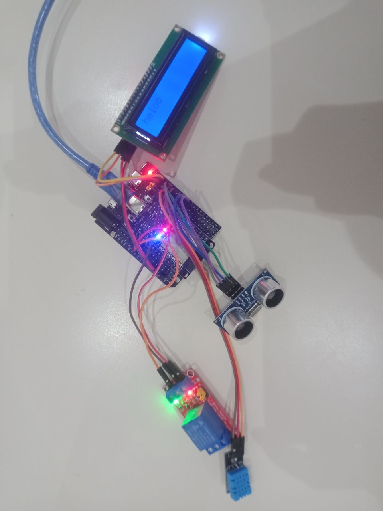
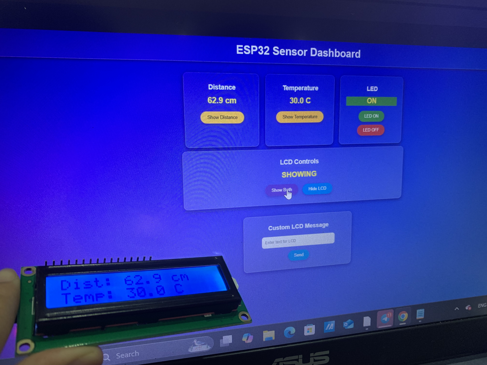

# LAB2: IoT Webserver with LED, Sensors, and LCD Control

## 1. Overview

In this lab, an ESP32-based IoT system was designed with MicroPython, integrating a web interface and an LCD display.
The system allows users to control an LED, read temperature and distance sensors, and send custom messages to the LCD through a browser.
This project highlights the interaction between web UI and physical hardware, giving practice in event-driven IoT design.

---

## 2. Learning Outcomes

- Implement a MicroPython webserver to serve HTML controls.
- Control an LED from a web interface.
- Read data from DHT11 and ultrasonic sensors and display it on the webserver.
- Use web buttons to selectively show sensor values on an LCD.
- Send custom text from a textbox to be displayed on the LCD.
- Document wiring, interface behavior, and system operation.

---

## 3. Equipment

- ESP32 Dev Board (MicroPython flashed)
- DHT11 temperature/humidity sensor
- HC-SR04 ultrasonic distance sensor
- LCD 16x2 with I²C backpack
- Breadboard, jumper wires
- USB cable + laptop with Thonny
- Wi-Fi access

---

## 4. Wiring

The ESP32 was connected with the DHT11, ultrasonic sensor, and LCD according to the wiring diagram provided.  
The LCD uses I²C pins, LED control is on GPIO2, and sensors are powered via 5V/GND.

---

## 5. Tasks & Checkpoints

### Task 1: LED Control

Two buttons (ON/OFF) were added to the web page to control the LED on GPIO2.  
Clicking the buttons successfully toggles the LED state.

Evidence: Video Link: https://youtu.be/nAk7JooazBc

---

### Task 2: Sensor Read

The ESP32 reads both the DHT11 temperature and the HC-SR04 ultrasonic sensor.  
Values are shown on the web page and updated every 1-2 seconds.

Evidence:  

---

### Task 3: Sensor → LCD

Two buttons were added to the web page:

- **Show Distance** → Displays the ultrasonic distance on LCD line 1.
- **Show Temperature** → Displays the temperature on LCD line 2.

The LCD correctly reflects sensor values after button clicks.

Evidence:  

---

### Task 4: Textbox → LCD

A textbox and **Send** button were implemented on the web page.  
Users can enter custom text, which is displayed on the LCD in real time.  
Longer text scrolls automatically if it exceeds the display width.

## Video link: https://youtu.be/LLAH0TES7wo

### Task 5: Documentation

This README includes:

- Wiring diagram and real hardware photo
- Setup instructions for Wi-Fi and running the MicroPython server
- Usage instructions for LED, sensor readings, and LCD text
- Screenshots and photos showing the system in action
- A short demo video link showing the LED, sensors, and LCD in operation

## 6. Submission

This lab is submitted through a private GitHub repo containing:

- Source code (`main.py` + LCD helper files)
- README.md (this file)
- Screenshots (web UI, LCD photos)
- Short demo video link

---

## Author

Julie Lou and Panhakuntheakreaksmey
