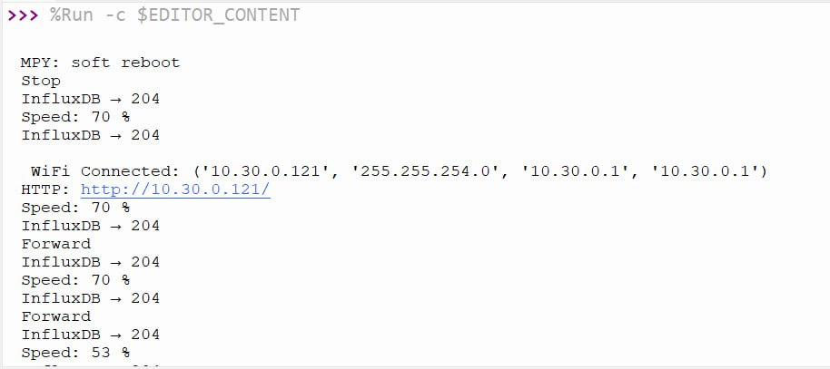
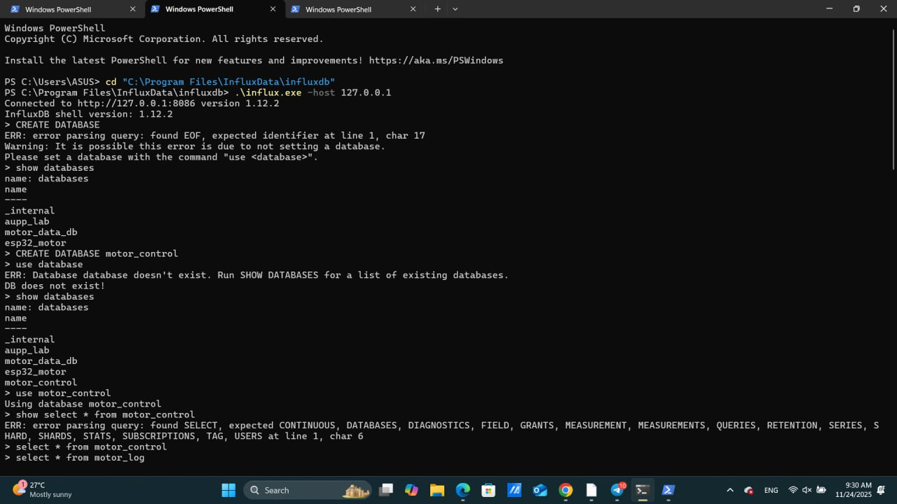
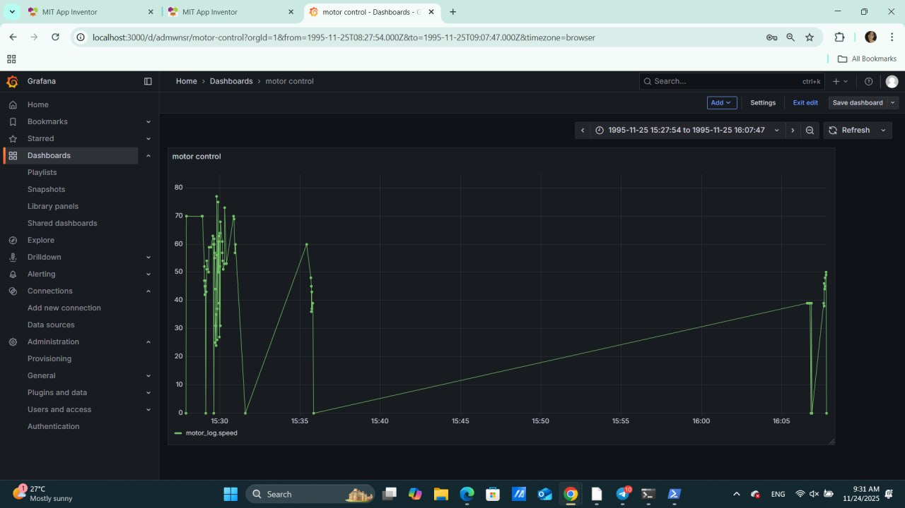

# LAB 5 – Mobile App DC Motor Control with Grafana Dashboard

This repository contains my implementation of **LAB 5: Mobile App DC Motor Control with Grafana Dashboard**, fulfilling all required tasks as described in the provided PDF, including:

- ESP32 Web Server Setup
- MIT App Inventor Mobile App (Forward/Backward/Stop/Speed Control)
- InfluxDB Logging
- Grafana Dashboard Visualization
- System Testing & Demonstration

All required screenshots from my implementation are included below.

---

# 📌 1. System Overview

This project demonstrates a complete IoT actuation and monitoring system:

1. A **mobile app** sends HTTP commands to an **ESP32 web server**.
2. The ESP32 controls a **DC motor** via an **L298N driver**.
3. The ESP32 logs motor activity into **InfluxDB**.
4. **Grafana** visualizes motor speed and actions in real time.

---

# 📌 2. Task 1 – ESP32 Web Server

The ESP32 runs MicroPython and hosts an HTTP server to control the DC motor.

### Implemented Endpoints

| Endpoint             | Description                       |
| -------------------- | --------------------------------- |
| `/forward?speed=NN`  | Moves motor forward at NN% speed  |
| `/backward?speed=NN` | Moves motor backward at NN% speed |
| `/stop`              | Stops the motor                   |
| `/speed?value=NN`    | Updates motor speed               |

### ✔ ESP32 Web Server Output (Screenshot)



The screenshot shows:

- WiFi connection
- Motor commands received
- Speed changes
- InfluxDB write success (`204`)

---

# 📌 3. Task 2 – Mobile App (MIT App Inventor)

A simple Android UI was created with:

- **Backward button**
- **Stop button**
- **Forward button**
- **Speed slider (0–100%)**

Each button sends an HTTP request to the ESP32.

### ✔ Mobile App Interface (Screenshot)


Link to Demonstration video: https://youtube.com/shorts/-v55SRtZfAU

---

# 📌 4. Task 3 – InfluxDB Logging

The ESP32 logs:

- Timestamp
- Action (forward/backward/stop)
- Speed value

### InfluxDB Setup Commands

```
CREATE DATABASE motor_control
USE motor_control
SHOW MEASUREMENTS
SELECT * FROM motor_log
```

### ✔ InfluxDB Shell Output (Screenshot)



---

# 📌 5. Task 4 – Grafana Dashboard

Grafana visualizes the data from InfluxDB.

### Dashboard Features:

- **Real-time motor speed graph**
- **Action history trend**
- **Timestamped activity logs**

### ✔ Grafana Panel (Screenshot)



---

# 📌 6. Task 5 – Reliability Improvements

To meet the requirement, the following were implemented:

- Auto-reconnect for WiFi
- HTTP error handling
- Input validation for speed range
- Confirmation logs for InfluxDB write result
- Serial monitoring for troubleshooting

---

# 📌 7. Hardware Setup

### Components

- ESP32 Devkit
- L298N Motor Driver
- DC Motor
- External Motor Power Supply
- Jumper Wires
- Laptop (Thonny, InfluxDB, Grafana)
- Android Phone (MIT App Inventor)

### Wiring Table

| ESP32 Pin | L298N Pin | Description       |
| --------- | --------- | ----------------- |
| GPIO 25   | ENA       | PWM speed control |
| GPIO 26   | IN1       | Motor direction 1 |
| GPIO 27   | IN2       | Motor direction 2 |
| GND       | GND       | Common ground     |

---

# 📌 8. Repository Structure

```
.
├── main.py
├── mobile_app.aia
├── README.md
└── images/
    ├── task1.jpeg
    ├── task2.jpeg
    ├── task3.jpeg
    └── task4.jpeg
```

_(Replace file names as needed when uploading.)_

---

# 📌 9. Reflection

### System Latency

Motor command response is almost instantaneous (<1 sec).  
Network congestion may cause slight delays.

### Data Logging

InfluxDB successfully stores every command.  
Grafana correctly displays real-time graphs.

---

# 📌 10. Conclusion

This project successfully integrates **mobile app control**, **IoT device actuation**, and **cloud-style logging & visualization** using **Grafana + InfluxDB**.  
All required task outputs have been implemented and documented.

---

# ✅ End of README
